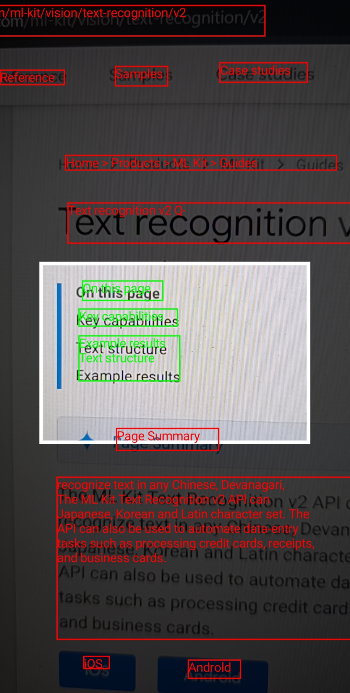

# MLKit Text Recognition In Box

A focused, modern Android sample demonstrating **real-time text recognition with CameraX and ML Kit**, built entirely with **Jetpack Compose**. It showcases how to overlay detected text back onto the camera preview and how to filter recognition results to only those inside a centered scan-area bounding box.

> This is a simplified, modern reimplementation of the text-recognition portion of the [Google ML Kit Vision Quickstart](https://github.com/googlesamples/mlkit/tree/master/android/vision-quickstart), replacing the traditional View-based approach with a fully Compose-native architecture.

---

## Features

- **Live text recognition** from the device camera using [ML Kit Text Recognition v2](https://developers.google.com/ml-kit/vision/text-recognition/android).
- **CameraX** integration (`ImageAnalysis` + `Preview` use-cases) managed inside a Composable.
- **Bounding-box scan area** — a centred semi-transparent overlay that acts as a region of interest.
- **In-box / out-of-box classification** — text blocks detected *inside* the scan area are highlighted in **green**; those *outside* are highlighted in **red**.
- **Accurate coordinate mapping** between ML Kit image space and Compose canvas space, supporting both `FIT_CENTER` and `FILL_CENTER` preview scale types.
- **Compose-first architecture** — no custom `View` subclasses, no XML layouts beyond the manifest.

---

## Screenshots / Demo



---

## Comparison with the Google Vision Quickstart

| | [Google Vision Quickstart](https://github.com/googlesamples/mlkit/tree/master/android/vision-quickstart) | This project |
|---|---|---|
| **UI framework** | View system (XML layouts) | Jetpack Compose |
| **Overlay** | Custom `GraphicOverlay` View | Native Canvas composables |
| **Scope** | All vision APIs (faces, objects, …) | Text recognition only |
| **Image source** | Still image, camera, CameraX | CameraX only |
| **Scale type support** | FIT + FILL | FIT + FILL |
| **Complexity** | High (generic, multi-feature) | Low (single-purpose, easy to read) |

---

## Architecture Overview

```
MainActivity
└── CameraXLivePreviewScreen          ← initialises ProcessCameraProvider
    └── CameraPreview                 ← owns the camera lifecycle bindings & overlay stack
        ├── AndroidView(PreviewView)  ← raw camera preview surface
        ├── BoundingBoxGraphic        ← scan-area overlay (Canvas)
        └── TextGraphicOverlay ×N    ← one per detected text block (Canvas)

CameraPreviewViewModel
├── processImage()                    ← delegates to TextRecognitionProcessor
├── handleResult()                    ← partitions blocks into inside/outside
└── StateFlow<CameraPreviewUiState>   ← consumed by CameraPreview

mlkit/overlay/
├── BoundingBox          ← defines the scan-area in Dp, converts to pixel Rect
├── BoundingBoxPx        ← pixel representation, computes centred Rect
├── BoundingBoxGraphic   ← Composable Canvas: dim + clear-hole + white border
├── CoordinateTransformer← bidirectional image↔canvas coordinate mapping
├── ImageSourceInfo      ← width/height of the camera image (rotation-corrected)
└── TextGraphicOverlay   ← Composable Canvas: draws text label + bounding rect
```

---

## Key Concepts Explained

### 1. CameraX Setup in Compose (`CameraPreview.kt`)

CameraX use-cases are bound inside a `LaunchedEffect(cameraProvider)` block, which re-runs whenever the camera provider changes. The `ImageAnalysis` use-case uses `STRATEGY_KEEP_ONLY_LATEST` to avoid frame-queue build-up.

```kotlin
val analysisUseCase = ImageAnalysis.Builder()
    .setBackpressureStrategy(ImageAnalysis.STRATEGY_KEEP_ONLY_LATEST)
    .build()

analysisUseCase.setAnalyzer(ContextCompat.getMainExecutor(context)) { imageProxy ->
    viewModel.processImage(imageProxy)
}
```

The `PreviewView` is embedded via `AndroidView`, and its `scaleType` is forwarded from the composable parameter — making it easy to switch between `FIT_CENTER` and `FILL_CENTER`.

---

### 2. Coordinate Space Problem

ML Kit returns bounding boxes in **image coordinates** (e.g. 1280×720). The Compose Canvas draws in **screen coordinates** (e.g. 1080×2340). These two spaces differ in both scale and origin due to camera preview scaling.

The `CoordinateTransformer` class resolves this by computing:
- A **scale factor** based on whether the preview is scaled by width or height.
- **Post-scale offsets** to handle the letterboxing or cropping introduced by FIT/FILL modes.

```
Image space  ──translateX/Y──▶  Canvas space
Canvas space ──inverseTranslateX/Y──▶  Image space
```

The inverse direction is used to convert the on-screen scan-area rectangle *back* into image coordinates, so it can be compared against ML Kit's bounding boxes.

**FIT_CENTER** — the entire image fits inside the canvas; black bars may appear on the sides or top/bottom.  
**FILL_CENTER** — the canvas is fully covered; parts of the image may be cropped.

---

### 3. Scan Area & In-Box Filtering

The scan area is a `300dp × 200dp` rectangle, always centred on screen:

```kotlin
// BoundingBoxPx.toRect()
Rect(
    ((containerSize.width  - width)  / 2).toInt(),
    ((containerSize.height - height) / 2).toInt(),
    ((containerSize.width  + width)  / 2).toInt(),
    ((containerSize.height + height) / 2).toInt(),
)
```

To check whether a recognised text block is inside, the scan area is mapped back to image coordinates via `CoordinateTransformer.inverseTranslate*()`, then compared with `Rect.contains()`:

```kotlin
val (inside, outside) = text.textBlocks.partition { block ->
    val imageRect = block.boundingBox ?: return@partition false
    scanAreaInImageSpace!!.contains(imageRect)
}
```

This approach correctly handles both FIT and FILL scale modes because the inverse transform is always consistent with the forward transform used for drawing.

---

### 4. Image Source Info & Rotation

Camera images arrive with a `rotationDegrees` value. When the rotation is 0° or 180° the natural width is the X-axis; when it is 90° or 270° the axes are swapped. The `ImageSourceInfo` is constructed once and accounts for this:

```kotlin
val info = if (rotation == 0 || rotation == 180) {
    ImageSourceInfo(imageProxy.width, imageProxy.height)
} else {
    ImageSourceInfo(imageProxy.height, imageProxy.width)   // swap
}
```

---

### 5. `BoundingBoxGraphic` — The Dimming Overlay

The scan-area overlay is drawn with three Canvas operations on a single `Canvas` composable:

1. **Black semi-transparent rect** covering the full canvas.
2. **Transparent rect** (using `BlendMode.Clear`) punching a "hole" in the dim layer at the scan-area position.
3. **White stroked rect** drawing the visible border around the clear window.

```kotlin
drawRect(color = Color.Black, alpha = 0.7f)                          // dim
drawRect(color = Color.Transparent, ..., blendMode = BlendMode.Clear) // clear hole
drawRect(color = Color.White, ..., style = Stroke(width = 4.dp.toPx())) // border
```

---

### 6. `TextGraphicOverlay` — Drawing Text & Boxes

Each recognised text block gets its own `TextGraphicOverlay` composable. It converts ML Kit image coordinates to canvas coordinates via the `CoordinateTransformer` and then draws a labelled rectangle:

```kotlin
val left   = transformer.translateX(boundingBox.left.toFloat())
val top    = transformer.translateY(boundingBox.top.toFloat())
val right  = transformer.translateX(boundingBox.right.toFloat())
val bottom = transformer.translateY(boundingBox.bottom.toFloat())

drawText(textMeasurer, text = text, topLeft = Offset(min(left, right), min(top, bottom)))
drawRect(color, topLeft = ..., size = Size(abs(right - left), abs(bottom - top)), style = Stroke(4f))
```

Using `minOf`/`abs` guards against coordinates that could be flipped depending on image orientation.

---

## Project Structure

```
app/src/main/java/com/entourage/mlkittextdetectioninbox/
│
├── MainActivity.kt                          ← Entry point, hosts the theme & root composable
│
├── mlkit/
│   ├── overlay/
│   │   ├── BoundingBox.kt                   ← Dp-based scan area definition
│   │   ├── BoundingBoxGraphic.kt            ← Dimming overlay composable
│   │   ├── CoordinateTransformer.kt         ← Image ↔ canvas coordinate math
│   │   ├── ImageSourceInfo.kt               ← Camera image dimensions data class
│   │   └── TextGraphicOverlay.kt            ← Per-block text + rect composable
│   │
│   └── textrecognition/
│       ├── CameraPreview.kt                 ← Main composable: camera + overlays
│       ├── CameraPreviewViewModel.kt        ← ViewModel: state, filtering logic
│       ├── CameraXLivePreviewScreen.kt      ← Screen: initialises camera provider
│       └── TextRecognitionProcessor.kt      ← Wraps ML Kit TextRecognizer
│
└── ui/theme/
    ├── Color.kt
    ├── Theme.kt
    └── Type.kt
```

---

## Getting Started

### Prerequisites

- Android Studio Hedgehog or newer
- Android device or emulator with **API 33+** (minSdk = 33)
- Physical camera recommended for best results

### Setup

1. Clone the repository:
   ```bash
   git clone https://github.com/Arnaud-Parion/MlKit-Text-Recognition-Jetpack-Compose.git
   ```
2. Open the project in Android Studio.
3. Sync Gradle — no additional configuration needed; ML Kit text recognition runs fully on-device.
4. Run on a physical device and grant the camera permission.

---

## Dependencies

| Library | Purpose |
|---|---|
| `com.google.mlkit:text-recognition:16.0.1` | On-device Latin text recognition |
| `androidx.camera:camera-core` | CameraX core APIs |
| `androidx.camera:camera-camera2` | Camera2 implementation |
| `androidx.camera:camera-lifecycle` | Lifecycle-aware camera binding |
| `androidx.camera:camera-view` | `PreviewView` widget |
| `androidx.compose.*` (BOM) | Jetpack Compose UI toolkit |
| `androidx.lifecycle:lifecycle-viewmodel` | `ViewModel` / `StateFlow` |

---

## License

```
Copyright 2026 Arnaud Parion

Licensed under the Apache License, Version 2.0 (the "License");
you may not use this file except in compliance with the License.
You may obtain a copy of the License at

    http://www.apache.org/licenses/LICENSE-2.0

Unless required by applicable law or agreed to in writing, software
distributed under the License is distributed on an "AS IS" BASIS,
WITHOUT WARRANTIES OR CONDITIONS OF ANY KIND, either express or implied.
See the License for the specific language governing permissions and
limitations under the License.
```
